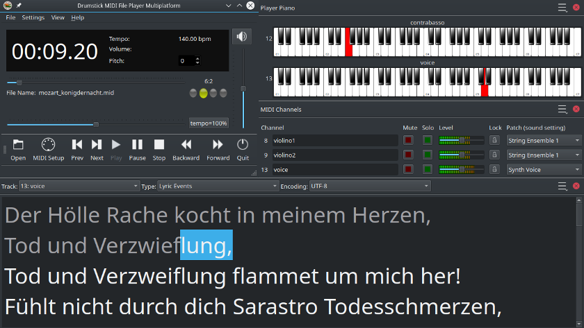

Drumstick MIDI File Player - multiplatform
==========================================

[Drumstick](https://drumstick.sourceforge.io/docs/index.html) is a set of GPLv3 licensed C++/Qt libraries for MIDI applications. The project includes several tools as examples, and among them is the drumstick-guiplayer utility that leverages the Drumstick::ALSA library, so it is available only for Linux (because the ALSA sequencer is a linux only technology). Some people have requested a program with the same functionalities on Windows and macOS, so here it is ...



Some key features:

* MIDI Output to hardware MIDI ports, or any other Drumstick backend
* Transpose song tonality between -12 and +12 semitones
* Change MIDI volume level (using MIDI CC7)
* Scale song speed between half and double tempo

New in v1.1.0:

* Pianola, Channels and Rhythm views
* Sticky Window Snapping (Windows OS only)
* Russian translation (Thanks to Sergey Basalaev)
* Spanish translation updated
* Recent files menu options
* Language choice menu options
* Command line options: --portable and --file (for portable configuration)

New in v1.2.0:

* Lyrics view (karaoke window)
* Character encoding detection
* File Info (metadata) dialog

This multiplatform version offers equivalent functionality replacing Drumstick::ALSA by Drumstick::RT. The MIDI events scheduling/timing is performed inside the program with the only  help of the C++ standard library (threads and chrono). The MIDI output still has access to each operating system's MIDI infrastructure, but also to additional backends like ipMidi and soft synths.

Alright, these are the build requirements:

* C++11 compiler
* Qt5
* Drumstick 2.1
* CMake 3.10

Build and deployment commands (for Linux)

```
$ tar -xvzf dmidiplayer-1.1.0.tar.gz
$ cd dmidiplayer-1.1.0
$ mkdir build
$ cd build
$ cmake .. -DCMAKE_PREFIX_PATH="$HOME/Qt5;$HOME/drumstick2"
$ make
$ make install
```
You need to replace the contents of the parameter CMAKE_PREFIX_PATH with the actual paths in your system. There are x86_64 precompiled packages for Linux, Windows and macOS at the releases area.

Enjoy!
